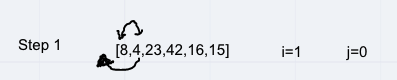
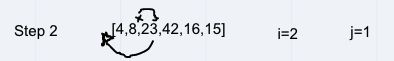
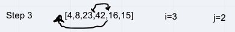
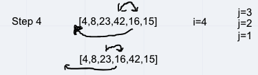
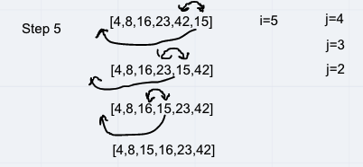

# Insertion Sort

Insertion Sort is a sorting algorithm that is based off of comparing an array value to the one before it. Insertion sort takes in an array of integers and sorts them into ascending order.

## Pseudocode

```html
  InsertionSort(int[] arr)
  
    FOR i = 1 to arr.length
    
      int j <-- i - 1
      int temp <-- arr[i]
      
      WHILE j >= 0 AND temp < arr[j]
        arr[j + 1] <-- arr[j]
        j <-- j - 1
        
      arr[j + 1] <-- temp
```

sample array: [8, 4, 23, 42, 16, 15]

__Step 1:__ On the first iteration, `i = 1`, `j = 0` and `temp = array[i] (= 4)`. It goes into the while loop which evaluates as true. This means `array[1]` becomes 8. The array evaluates to `[8, 8, 23, 42, 16, 15]`. This time while entering the while loop, `j` evaluates to `-1` and which breaks the loop. At this point the `array[j + 1]` is changed to be the value of temp and the array evaluates to `[4, 8, 23, 42, 16, 15]`.



__Step 2:__ On the second iteration `i = 2`, `j = 1` and `temp = array[i] (= 23)`. It goes into the while loop which evaluates to false, so nothing changes. The array is `[4, 8, 23, 42, 16, 15]`.



__Step 3:__ On the third iteration `i = 3`, `j = 2` and `temp = array[i] (= 42)`. It goes into the while loop which evaluates to false, so nothing changes. The array is `[4, 8, 23, 42, 16, 15]`.



__Step 4:__ On the fourth iteration `i = 4`, `j = 3` and `temp = array[i] (= 16)`. It goes into the while loop which evaluates to true. This means array[i] becomes `42`, `j = 2` and the `temp` is held on to. The array is `[8, 4, 23, 42, 42, 15]`. The loop repeats and evaluates to true again. This means `array[3]` becomes `23`, `j = 1` and the loop repeats again (array is `[4, 8, 23, 23, 42, 15]`) but the conditional evaluates to false. At this point the `array[j + 1]` is changed to be the value of temp and the array evaluates to `[4, 8, 16, 23, 42, 15]`.



__Step 5:__ On the fifth iteration `i = 5`, `j = 4` and `temp = array[i] (= 15)`. It goes into the while loop which evaluates to true. This means array[i] becomes `42`, `j = 3` and the `temp` is held on to. The array is `[8, 4, 16, 23, 42, 42]`. The loop repeats and evaluates to true again. This means `array[4]` becomes `23`, `j = 2` and the loop repeats again (array is `[4, 8, 16, 23, 23, 42]`) and evaluates to true again. This means `array[3]` becomes `16` and `j = 1` and the loop repeats again (array is `[4, 8, 16, 16, 23, 42]`) but the conditional evaluates to false. At this point the `array[j + 1]` is changed to be the value of temp and the array evaluates to `[4, 8, 15, 16, 23, 42]`. At this point, the for loop completes and returns the sorted array.



## Efficiency

- Time: O(n^2)
  - The basic operation of this algorithm is comparison. This will happen n * (n-1) number of times…concluding the algorithm to be n squared.

- Space: O(1)

  - No additional space is being created. This array is being sorted in place…keeping the space at constant O(1).
  