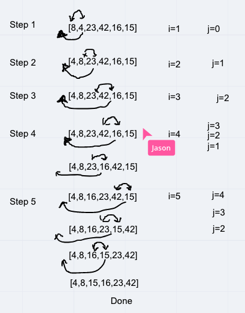

# Challenge Summary
<!-- Short summary or background information -->
Step through the pseudo code for insertion sort. Write a blog style article and solve it.

## Challenge Description
<!-- Description of the challenge -->
Review the pseudocode below, then trace the algorithm by stepping through the process with the provided sample array. Document your explanation by creating a blog article that shows the step-by-step output after each iteration through some sort of visual.

Once you are done with your article, code a working, tested implementation of Insertion Sort based on the pseudocode provided.

## Pseudo Code

```javascript
  InsertionSort(int[] arr)
  
    FOR i = 1 to arr.length
    
      int j <-- i - 1
      int temp <-- arr[i]
      
      WHILE j >= 0 AND temp < arr[j]
        arr[j + 1] <-- arr[j]
        j <-- j - 1
        
      arr[j + 1] <-- temp
```

## Approach & Efficiency
<!-- What approach did you take? Why? What is the Big O space/time for this approach? -->

- Time: O(n^2)
  - The basic operation of this algorithm is comparison. This will happen n * (n-1) number of times…concluding the algorithm to be n squared.

- Space: O(1)

  - No additional space is being created. This array is being sorted in place…keeping the space at constant O(1).

## Collaborators

- Carly Dekock

- Jason Dormier

- Nick Magruder

- Seid Mohamed

## Resources

- [codefellows docs](https://codefellows.github.io/common_curriculum/data_structures_and_algorithms/Code_401/class-26/)

## Whiteboards

Tree Traversal

