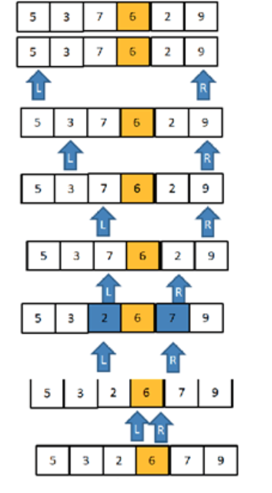
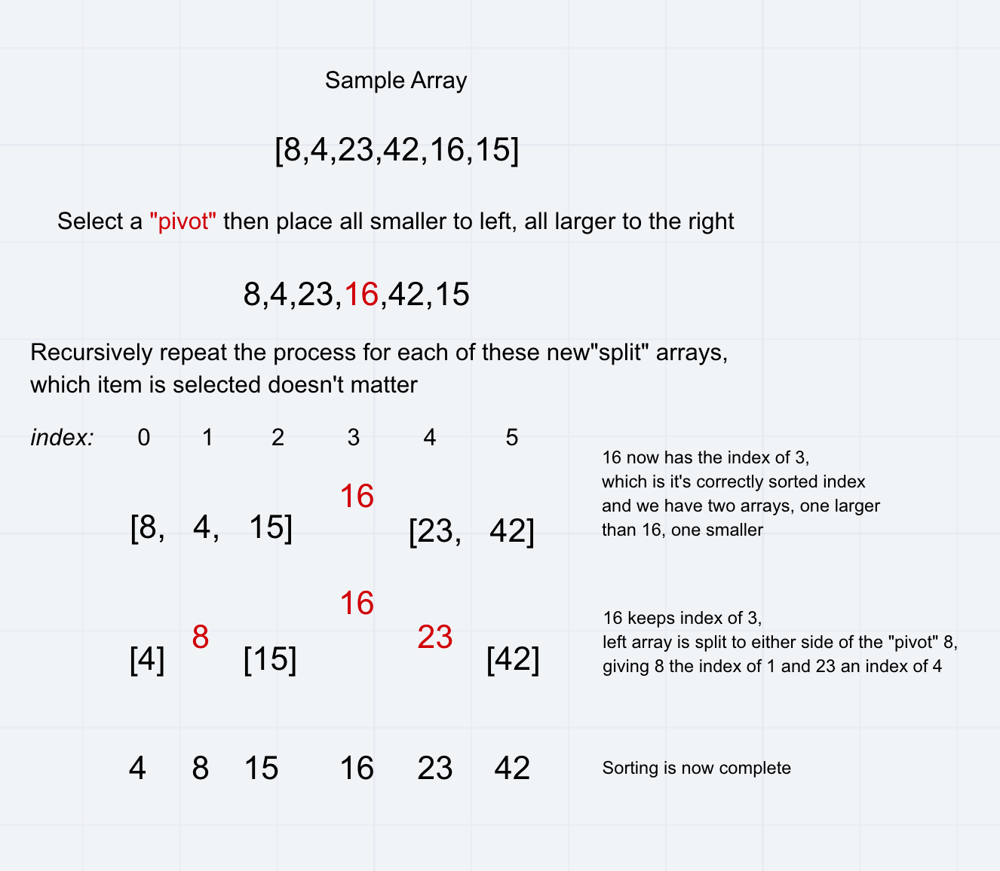

# Challenge Summary
<!-- Short summary or background information -->
Step through the pseudo code for quick sort. Write a blog style article and solve it.

## Challenge Description
<!-- Description of the challenge -->
Review the pseudocode below, then trace the algorithm by stepping through the process with the provided sample array. Document your explanation by creating a blog article that shows the step-by-step output after each iteration through some sort of visual.

Once you are done with your article, code a working, tested implementation of Quick Sort based on the pseudocode provided.

## Pseudo Code

```javascript
ALGORITHM QuickSort(arr, left, right)
    if left < right
        // Partition the array by setting the position of the pivot value 
        DEFINE position <-- Partition(arr, left, right)
        // Sort the left
        QuickSort(arr, left, position - 1)
        // Sort the right
        QuickSort(arr, position + 1, right)

ALGORITHM Partition(arr, left, right)
    // set a pivot value as a point of reference
    DEFINE pivot <-- arr[right]
    // create a variable to track the largest index of numbers lower than the defined pivot
    DEFINE low <-- left - 1
    for i <- left to right do
        if arr[i] <= pivot
            low++
            Swap(arr, i, low)

     // place the value of the pivot location in the middle.
     // all numbers smaller than the pivot are on the left, larger on the right. 
     Swap(arr, right, low + 1)
    // return the pivot index point
     return low + 1

ALGORITHM Swap(arr, i, low)
    DEFINE temp;
    temp <-- arr[i]
    arr[i] <-- arr[low]
    arr[low] <-- temp
```

## Blog



__STEP 1:__ Determine pivot as middle element. So, 7 is the pivot element.

__STEP 2:__ Start left and right pointers as first and last elements of the array respectively. So, left pointer is pointing to 5 at index 0 and right pointer is pointing to 9 at index 5.

__STEP 3:__ Compare element at the left pointer with the pivot element. Since, 5 < 6 shift left pointer to the right to index 1.

__STEP 4:__ Now, still 3 <6 so shift left pointer to one more index to the right. So now 7 > 6 stop incrementing the left pointer and now left pointer is at index 2.

__STEP 5:__ Now, compare value at the right pointer with the pivot element. Since 9 > 6 move the right pointer to the left. Now as 2 < 6 stop moving the right pointer.

__STEP 6:__ Swap both values present at left and right pointers with each other.

__STEP 7:__ Move both pointers one more step.

__STEP 8:__ Since 6 = 6, move pointers to one more step and stop as left pointer crosses the right pointer and return the index of the left pointer.

## Approach & Efficiency
<!-- What approach did you take? Why? What is the Big O space/time for this approach? -->

- Time: O(n * log(n))

- Space: O(n * log(n))

## Collaborators

- Carly Dekock

- Jason Dormier

- Nick Magruder

- Seid Mohamed

## Resources

- [codefellows docs](https://codefellows.github.io/common_curriculum/data_structures_and_algorithms/Code_401/class-28/)

- [Blog that helped a ton](https://www.guru99.com/quicksort-in-javascript.html)

## Whiteboards

Merge Sort

