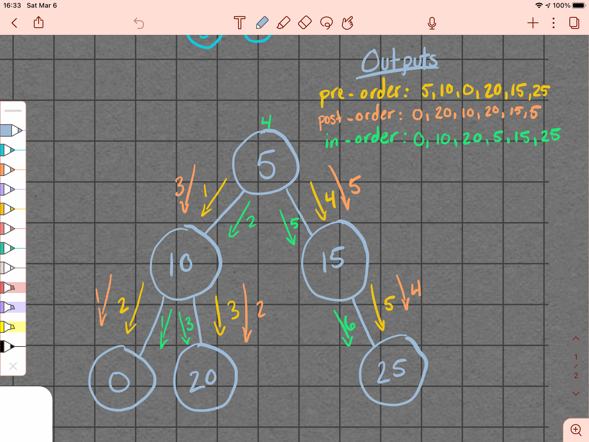
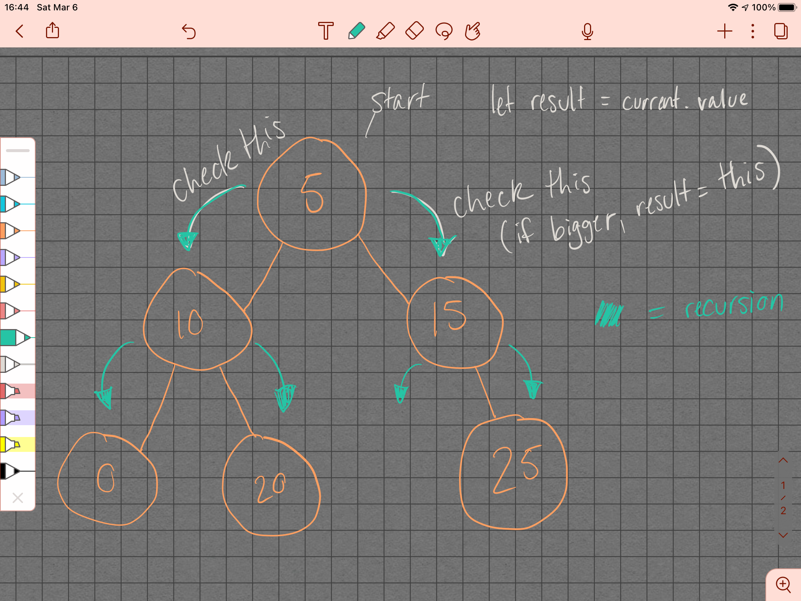

# Challenge Summary
<!-- Short summary or background information -->
Trees

## Challenge Description
<!-- Description of the challenge -->
1. Create a Node class that has properties for the value stored in the node, the left child node, and the right child node.

1. Create a BinaryTree class

    - Define a method for each of the depth first traversals called preOrder, inOrder, and postOrder which returns an array of the values, ordered appropriately.

1. Any exceptions or errors that come from your code should be semantic, capturable errors. For example, rather than a default error thrown by your language, your code should raise/throw a custom, semantic error that describes what went wrong in calling the methods you wrote for this lab.

1. Create a BinarySearchTree class

    - Define a method named add that accepts a value, and adds a new node with that value in the correct location in the binary search tree.
  
    - Define a method named contains that accepts a value, and returns a boolean indicating whether or not the value is in the tree at least once.

1. Write an instance method called find-maximum-value. Without utilizing any of the built-in methods available to your language, return the maximum value stored in the tree. You can assume that the values stored in the Binary Tree will be numeric.

## Approach & Efficiency
<!-- What approach did you take? Why? What is the Big O space/time for this approach? -->

- `preOrder` Space: O(n), Time: O(n)

- `postOrder` Space: O(n), Time: O(n)

- `inOrder` Space: O(n), Time: O(n)

- `add` Space: O(1), Time: O(h)

- `contains` Space: O(1), Time: O(h)

- `findMax` Space: O(n), Time: O()

## Collaborators

- Carly Dekock

- Jason Dormier

- Nick Magruder

- Seid Mohamed

## Resources

- [codefellows docs](https://codefellows.github.io/common_curriculum/data_structures_and_algorithms/Code_401/class-15/resources/Trees.html)

## Whiteboards

Tree Traversal

Find Max in Binary Tree

